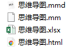
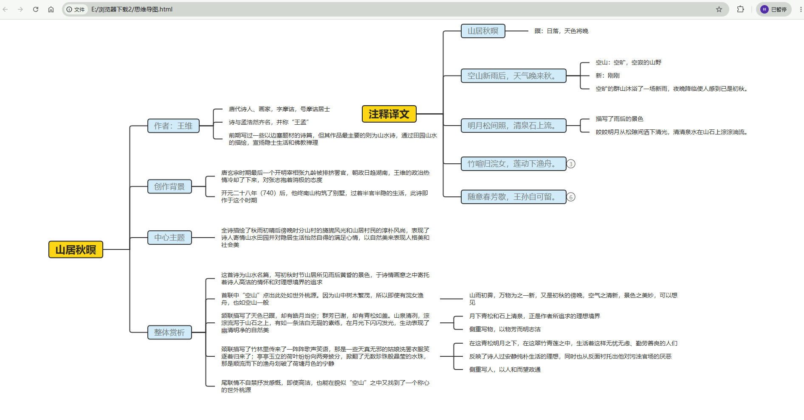
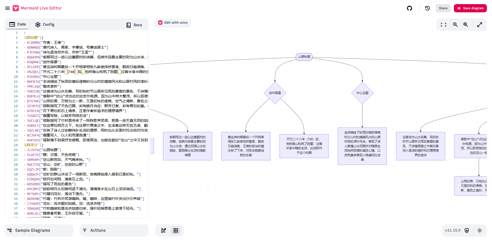

【[English](./README_en.md) | 简体中文】

# Obsidian SimpleMindMap 插件专业版功能清单

## 0.2.1

- 支持导出为Excel、Freemind、JPG、Mermaid、html格式文件

<table>
    <tr>
        <td align="center" style="word-wrap: break-word; width: 200; height: 200">
            
        </td>
        <td align="center" style="word-wrap: break-word; width: 200; height: 200">
            
        </td>
        <td align="center" style="word-wrap: break-word; width: 200; height: 200">
            
        </td>
        <td align="center" style="word-wrap: break-word; width: 200; height: 200">
            
        </td>
        <td align="center" style="word-wrap: break-word; width: 200; height: 200">
            
        </td>
    </tr>
</table>

- 导出的pdf文件节点超链接支持点击

- 支持导入xlsx、Freemind格式文件

- 支持粘贴Markdown、Txt内容导入

- 支持导入为当前激活节点的下级

- 支持填空模式

> 两种方式：演示模式中的填空模式、画布右键菜单直接进入填空模式。

- 专业版专属结构

> 专业版支持更多结构：表格、时间轴、鱼骨图。

- 节点支持添加标记

- 节点支持一键编号

- 节点支持添加待办

- 支持隐藏节点文本

- 节点连线支持虚线流动效果

- 专业版专属节点形状

- 节点外框样式支持设置不包含子节点

- 画布支持拖动的动量效果

- 支持smm代码块嵌入编辑

> 1.支持以`smm`格式嵌入代码块，嵌入后可转换为思维导图视图进行编辑；
>
> 2.仅支持基本的编辑能力：文本编辑（支持显示富文本工具栏）、快捷键操作、鼠标操作；
>
> 3.编辑视图右下角提供两个操作图标：回到根节点、适应画布；
>
> 3.编辑完成后，鼠标点击文档其他位置，会自动更新代码块源数据；
>
> 4.支持在设置中设置代码块嵌入的初始高度；
>
> 5.支持拖拽调整高度；

- 支持扩展思维导图可用的字体

> 1.在设置中管理字体；
>
> 2.新增的字体会在思维导图所有字体选择器中显示；

- 支持新标签页预览为思维导图：

> 打开Markdown文件时，可点击右上角更多按钮中的【新标签页预览为思维导图】按钮，会在新标签页中打开当前文件并预览为思维导图；

> Markdown文件修改后，预览的思维导图会自动更新；

更多专业版功能持续更新中...

# 功能建议

如有功能建议，请[在此提交](https://github.com/wanglin2/obsidian-simplemindmap/issues)。
